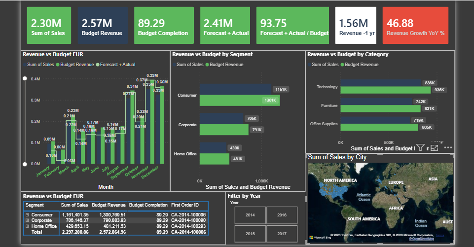

# 📊 Superstore Sales Dashboard — Power BI

## Overview
An interactive multi-page Power BI dashboard analyzing sales performance,
revenue vs budget, profit margins, and regional insights using the 
Superstore sample dataset.

Built as part of my data analyst portfolio to demonstrate DAX, 
data modeling, and dashboard design skills.

## 📸 Dashboard Preview

### Page 1 — Executive Summary

## 📄 Pages
### Page 1 — Executive Summary ✅
- 7 KPI cards: Total Sales, Budget Revenue, Budget Completion %,
  Forecast + Actual, Forecast vs Budget %, Revenue -1yr, YoY Growth %
- Monthly Revenue vs Budget bar + line chart
- Revenue by Segment and Category horizontal bar charts
- Revenue vs Budget data table
- Sales by City map
- Filter by Year slicer

## 🔧 DAX Measures Built
- `Total Sales` — SUM of Sales
- `Budget Revenue` — Sales × 1.12
- `Budget Completion %` — Total Sales ÷ Budget Revenue × 100
- `Forecast + Actual` — Forecast + Total Sales
- `Forecast vs Budget %` — Forecast ÷ Budget × 100
- `Revenue PY` — SAMEPERIODLASTYEAR
- `YoY Growth %` — Year-over-year % change
- `Profit Margin %` — DIVIDE(SUM(Profit), SUM(Sales)) × 100

## 🛠️ Tools Used
- Power BI Desktop
- DAX (Data Analysis Expressions)
- Superstore Sample Dataset

## 👩‍💻 About Me
Final-year Financial Mathematics & Industrial Statistics undergraduate  
with hands-on experience in Power BI, R, SPSS, and SQL.  

🔗 [LinkedIn](https://www.linkedin.com/in/suganya-satkunaananthan-sai/)
